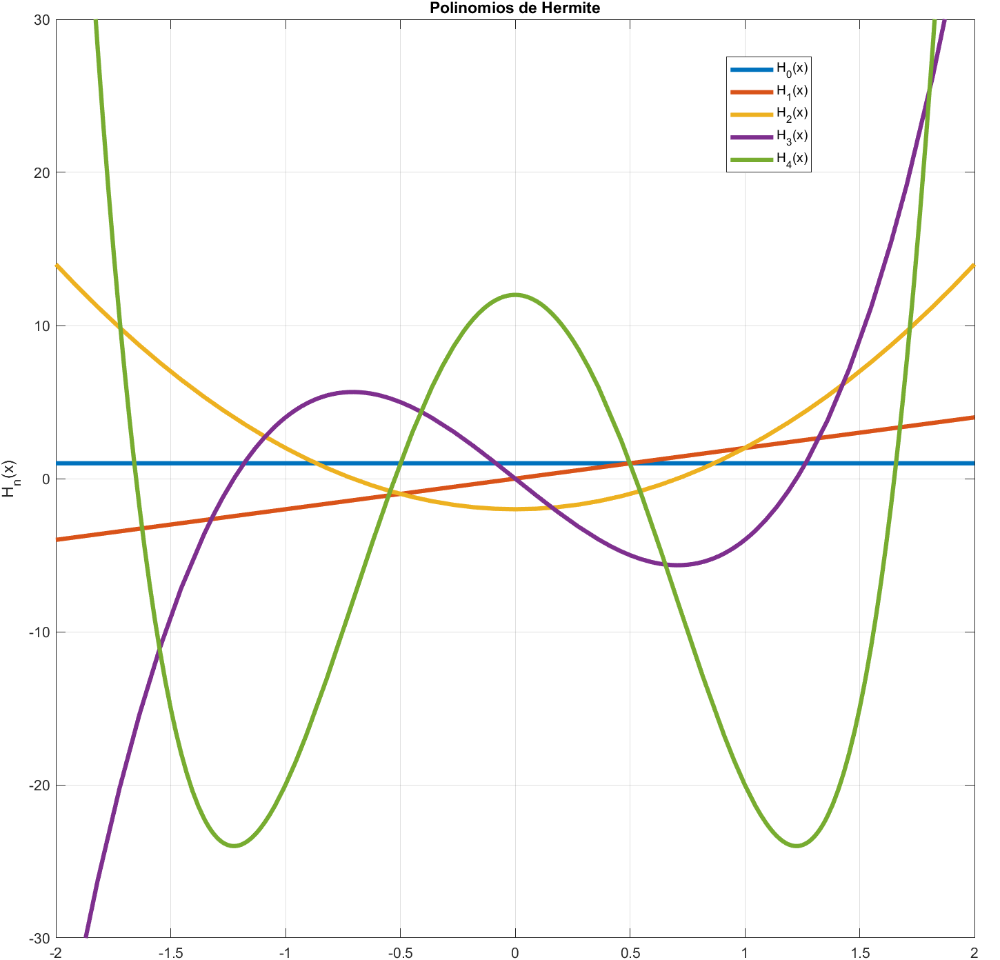
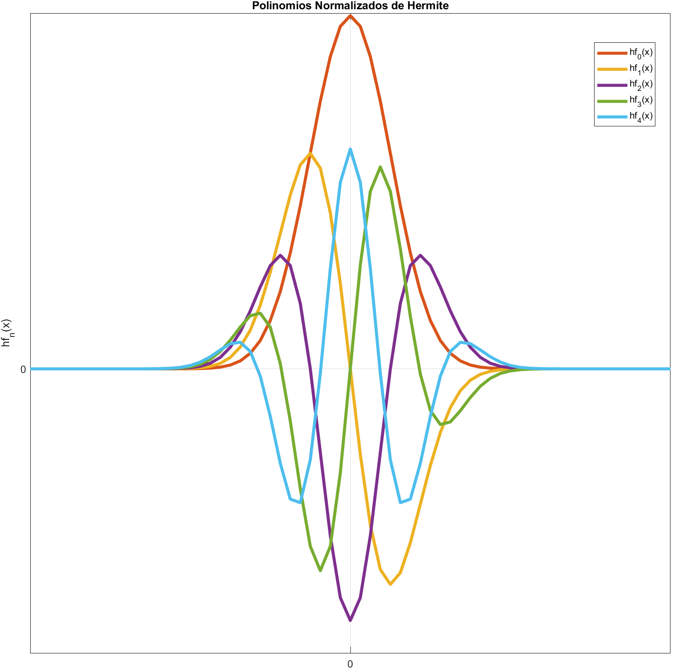
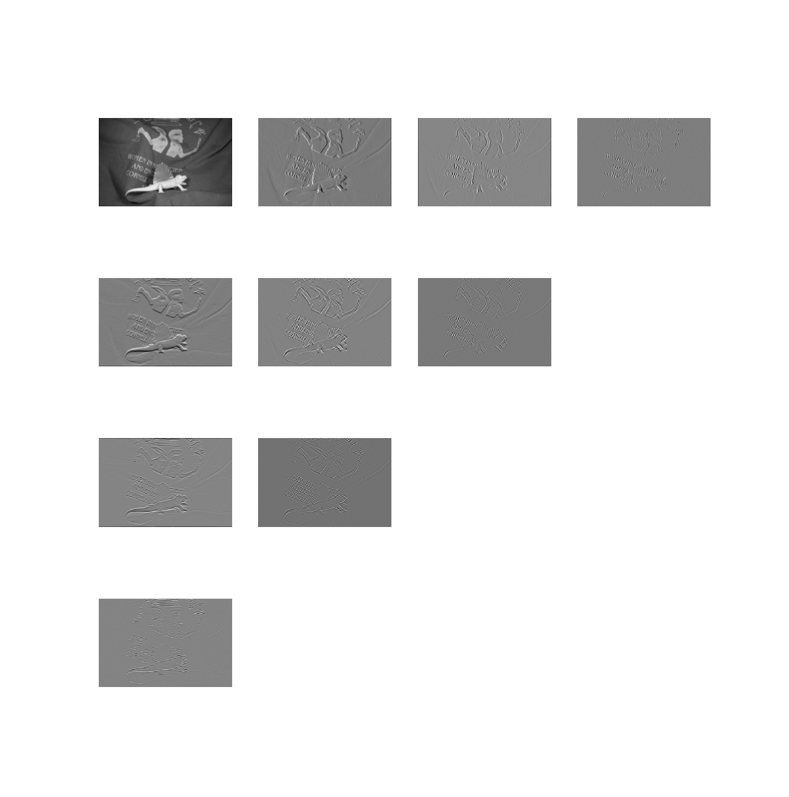
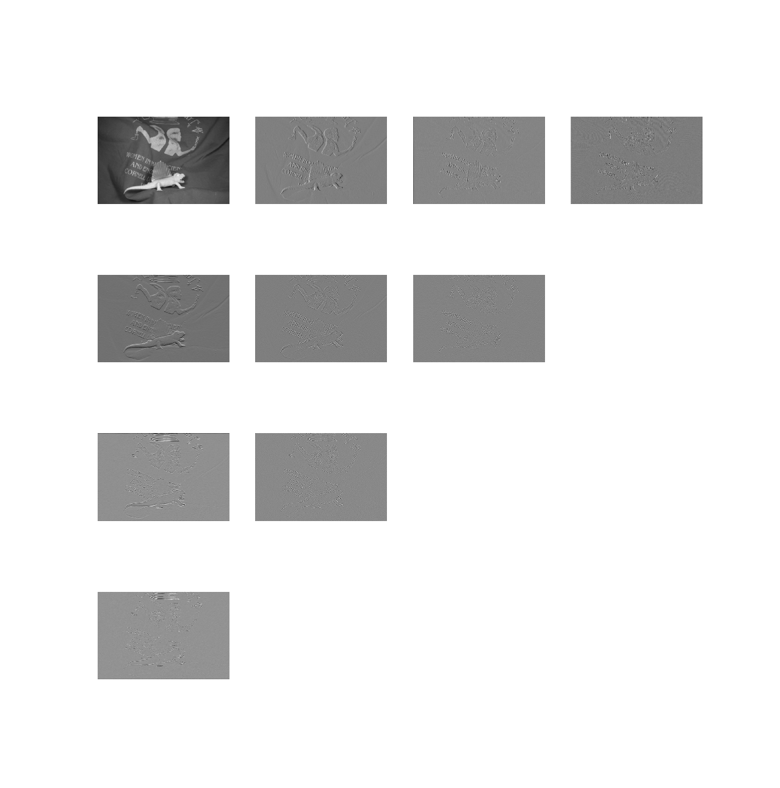
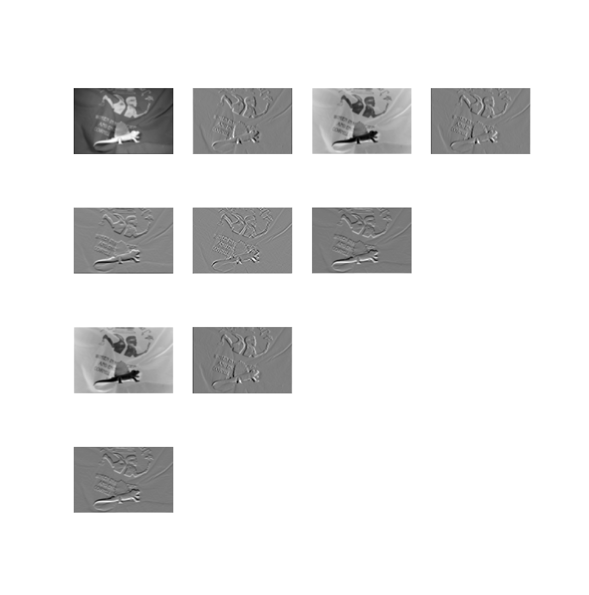
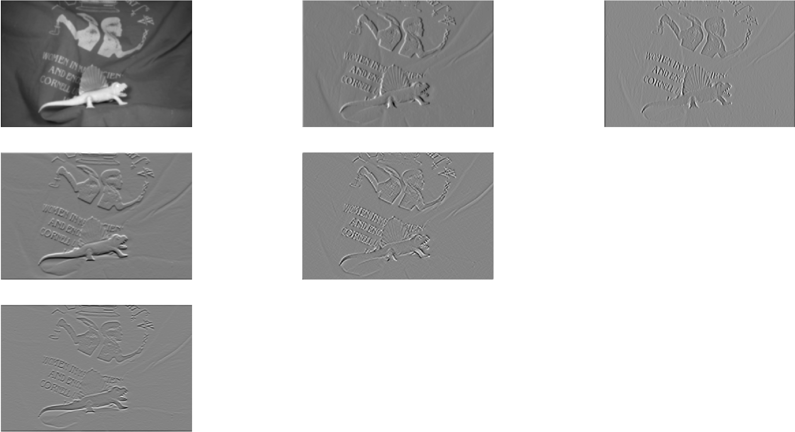
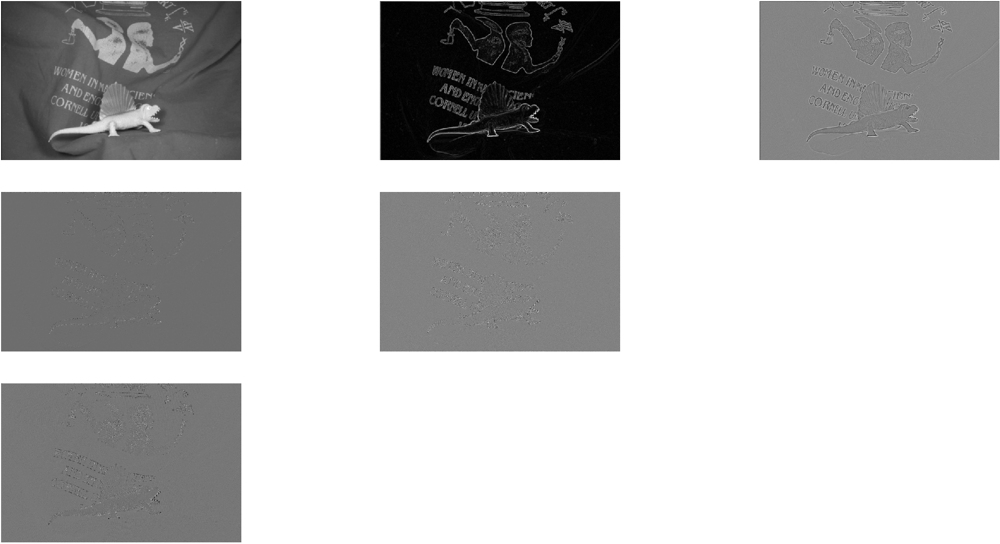

# Transformada de Hermite
La transformada Hermite como herramienta para el procesamiento digital de señales.
## Polinomios ortogonales clásicos
La ecuación diferencial general lineal de segundo orden en el intervalo definido entre  a , , es:
<p align="center"></p>
con su correspondiente ecuación homogénea:
<p align="center"></p>
y con el operador diferencial asociado:
<p align="center"></p>

Las familias de polinomios ortogonales clásicos se pueden obtener a través de funciones generadoras del operador diferencial , visto en la ecuación **1**. Este operador diferencial  debe cumplir con la condición de simetría con respecto al peso , es decir, si:
<p align="center"></p>

donde  y  son un par de funciones que se anulan fuera del intervalo cerrado y acotado por definición entre los valores  y , , con el producto interno definido como:

<p align="center"></p> 

y con el peso . Además, el operador diferencial  simétrico con respecto al peso  debe tener la siguiente forma:
<p align="center"></p>

A partir de estas definiciones y condiciones se precisa la extensión de la condición de simetría a una clase más larga de funciones y para lograrlo es necesario aplicar condiciones de frontera.

Suponiendo que las funciones , , , ,  y  se extienden como funciones continuas en el intervalo cerrado . Además, , ,  y  también son continuas en el mismo intervalo. Ahora, si el operador  es simétrico, entonces:

<p align="center"></p>

Si  se anula en ambos puntos de la frontera entonces no necesitamos condiciones adicionales en esa frontera, si no es así, se añaden condiciones sobre las funciones  y . De manera similar, si el intervalo es no acotado y semi infinito, , se deben imponer condiciones en , a menos que  en . Una función  que no sea idénticamente cero es una función generadora para el operador  con valor generador  si:

<p align="center"></p>

Si  y  son funciones generadoras con diferentes valores generadores  y  entonces:

<p align="center"></p>

además,  y  son ortogonales si .

Ahora, se supondrá la existencia de polinomios de grados 0, 1 y 2 que son funciones generadoras de , es decir, se asume que el espacio de los polinomios de grado  , , está en el dominio de . 

En primer lugar, se hará la suposición de que el peso  tiene integral finita:
<p align="center"></p>

Aplicando el operador , cuya condición de simetría con respecto al peso se mostró en la ecuación **2**, a la función constante  obtenemos , así que  debe ser una constante y podemos considerar que . De esta forma, aplicando  a  obtenemos:

<p align="center"></p>

esta expresión debe ser un polinomio de grado máximo 1. Ahora, si se considera :

<p align="center"></p>

por lo que  debe ser un polinomio de grado máximo 2, entonces, el polinomio  es de grado máximo 2.

La condición de simetría requiere que:
<p align="center"></p>

para toda  definida en el intervalo. Como se ha mencionado anteriormente, una condición necesaria para la simetría es que  en cada punto final del intervalo. Resumiendo, se buscan soluciones polinomiales  que sean funciones generadoras de un operador diferencial de la forma:

<p align="center"></p>  

donde , ,  y 

<p align="center"></p> 

A este tipo de operadores diferenciales se les denomina de tipo hipergeométrico o de tipo Sturm-Liouville. A la ecuación **5** se le denomina como la ecuación de Pearson.

Dado que  es un polinomio de grado máximo 2, después de normalizaciones (mapeos afines de la recta, multiplicación del peso, el operador y los polinomios por constantes) se obtiene que existen 5 tipos de familias de polinomios ortogonales que son funciones generadoras del operador diferencial hipergeométrico  (ecuación **4**) dependiendo del grado y las raíces de :

1.  constante: polinomios de **Hermite**.
2.  lineal: polinomios de **Laguerre**. 
3.  cuadátrico con raíces reales distintas: polinomios de **Jacobi**. 
4.  cuadátrico con raíces complejas distintas: polinomios de **Romanovski**.
5.  cuadrático con raíz doble: varias familias de polinomios.

Muchos problemas de matemáticas aplicadas y teóricas así como problemas de física conducen a ecuaciones de la forma:

<p align="center"></p>

donde  es una constante y  y  son polinomios de, al menos, segundo y primer grado, respectivamente. A esta ecuación se le conoce como ecuación diferencial del tipo hipergeométrico y se obtiene a través de las ecuaciones **2** y **3** e igualando:

<p align="center"></p>
<p align="center"></p>

y

<p align="center"></p>

Un aspecto que hay que tener en cuenta es que  no sólo es una constante sino que además es el valor generador del operador . Por otro lado, la relación que existe entre  y  en la ecuación **6** está dada por la ecuación de Pearson que indica que  es derivada de , siempre y cuando ambas estén multiplicadas por el peso .

En conclusión tenemos que, salvo normalizaciones, las únicas familias de polinomios ortogonales que son funciones generadoras de un operador diferencial de segundo orden que obedece a la ecuación **2**, es decir, un operador diferencial simétrico con respecto a un peso  positivo soportado dentro de la recta real, son las familias de Hermite, Laguerre y Jacobi. A estas familias se les suele denominar polinomios ortogonales clásicos. En la siguiente Tabla se muestra un resumen de las características de las familias clásicas.

| Funciones     | Hermite    | Laguerre | Jacobi         |
| :------------:|:------------------:|:-------------------------:| :-------------------------------------:|
|  | |              |                               |
|         |          |        |          |
|    | 1                  |                        |                                 |
|      |               |               |  |
|    |                |                        |                  |

## Polinomios de Hermite

El polinomio  debe ser de grado máximo 1. Resolviendo la ecuación diferencial, se tiene que , donde  es un polinomio de grado máximo 2. Las condiciones de frontera sólo se cumplen para , cuyo intervalo abierto es . Entonces, el polinomio  es un polinomio de grado 1, por lo tanto, el operador  en este caso es:

<p align="center"></p>

Por cada polinomio de grado , el operador  lo lleva a otro polinomio del mismo grado. El valor generador para este caso es . Los polinomios ortogonales con respecto al peso  son los polinomios de Hermite  y cumplen con . Una vez que el peso  es normalizado, éste corresponde a la distribución normal o Gaussiana.

## Transformada de Hermite

La transformada de Hermite (**TH**) es uan herramienta matemática que permite hacer una descomposición ortogonal de funciones. Fue desarrollada en los años 90 y desde entonces ha sido utilizada en muchas aplicaciones de análisis de imágenes. En esta herramienta, se usan los **polinomios de Hermite** como las funciones base de la descomposición.

Sea  el polinomio de Hermite de grado  y  el polinomio normalizado, con . Estos polinomios son ortogonales con respecto a una función gaussiana , es decir:

<p align="center"></p>

para  y donde  y  es la desviación estándar de la función gaussiana. Dada una función , definida en un espacio continuo, su **TH** de orden  se define como:

<p align="center"></p>

donde  corresponden a los coeficientes cartesianos de la transformación. Dado que la función  define una ventana, la descomposición se debe hacer para las distintas posiciones  donde se requiere analizar la función.

La implementación de la transformada se puede llevar a cabo a través de un proceso de convolución entre los filtros de Hermite y la función de entrada, y luego una operación de submuestreo en las posiciones de .

Los filtros de Hermite unidimensionales de orden  son definidos como:

<p align="center"></p>

Sustituyendo las definiciones dadas anteriormente de Gn(x) y V(x) en la ecuación **7**: 

<p align="center"></p>

En la siguiente imagen se presenta la comparación entre los polinomios y polinomios normalizados de Hermite, la diferencia principal radica en la multiplicación de los mismos por la función gaussiana.

Polinomios de Hermite        |  Polinomios Normalizados de Hermite
:---------------------------:|:-----------------------------------:
  |  

La transformada de Hermite bidimensional **TH2D** se define de forma similar. Sea  la función de entrada, entonces su TH2D se define como: 

<p align="center"></p>

donde   es la ventana gaussiana con la cual se define la condición de ortogonalidad,  son los polinomios de Hermite normalizados y  son los coeficientes de la transformada. Los índices de los polinomios varían como  y , donde  es el orden de la transformada. Análogamente, se pueden definir los filtros de Hermite bidimensionales como:

<p align="center"></p>

Sustituyendo y usando las propiedades de los polinomios de Hermite, se obtienen los filtros de Hermite bidimensionales: 

<p align="center"></p>

Los coeficientes  de la transformada se pueden obtener convolucionando el conjunto de filtros hf_{m, n-m}(x,y) con la función de entrada  y luego submuestreando en las posiciones . Los filtros bidimensionales de Hermite hasta el orden  se muestran en la siguiente figura:


## Transformada de Hermite Rotada

Una de las virtudes más reconocidas de la transformada de Hermite es su capacidad para hacer análisis direccional. Dado que en las imágenes y volúmenes es común encontrar patrones unidimensionales orientados, las transformadas direccionales llegan a ser de mucha utilidad. Los bordes y la textura son dos de las características más importantes que se pueden analizar usando procesamiento direccional. La TH cumple eficientemente con esta propiedad de rotación. Un filtro en una dirección determinada puede ser obtenido a través de una combinación lineal de unos filtros base, los cuales han sido definidos previamente en alguna dirección original. Este mismo concepto se puede extender a datos que han sido filtrados previamente con esos filtros base. Los coeficientes cartesianos de la TH en cada orden, para , son un conjunto base con el cual se pueden obtener coeficientes rotados a cierto ángulo determinado. Para llevar a cabo la rotación, se parte de la definición de los filtros de Hermite en el dominio de Fourier.

Para el proceso de rotación bidimensional, se obtiene la transformada de Fourier de los filtros definidos en la ecuación **9**:

<p align="center"></p>

donde  es la transformada de Fourier de . La rotación definida en coordenadas cartesianas para el caso bidimensional se define como:

<p align="center"></p>

Una rotación en el dominio espacial es equivalente a una rotación en el dominio de la frecuencia. Por lo tanto, la definición anterior aplica para las coordenadas en el dominio de la frecuencia. Reemplazando las coordenadas rotadas en la ecuación **10** se obtiene:

<p align="center"></p>

Desarrollando la ecuación **11** y usando la transformada de Fourier inversa podemos obtener los filtros de Hermite rotados para un orden . Dado que los coeficientes de la TH son obtenidos por un proceso de convolución entre la imagen de entrada y los filtros, es posible obtener los coeficientes rotados a partir de los cartesianos usando la ecuación **11**. Hay que resaltar que la
función Gaussiana es isotrópica, por lo cual no sufre modificaciones en el desarrollo anterior. Por ejemplo, los coeficientes de Hermite para los primeros dos órdenes son:

* Para ,

<p align="center"></p>

* Para ,

<p align="center"></p>

donde  y . De la misma forma se pueden obtener los coeficientes rotados para órdenes más altos de la transformada.

Finalmente, la **TH** presenta algunas ventajas con respecto a otros modelos de descomposición, las cuales han motivado el uso de esta transformada en este proyecto. Algunas de estas ventajas son:

* Es considerado un modelo de visión.
* Permite hacer análisis direccional.
* Las funciones bases de la descomposición son ortogonales.
* Los filtros son separables, lo cual permite una fácil implementación en varias dimensiones.
* El submuestreo es definido por el usuario.
* Permite hacer análisis multiescala y multiresolución.

# Descomposición de imagenes en coeficientes de Hermite

Como se ha descrito anteriormente, la función de peso  de los polinomios de Hermite es una función gaussiana. La función gaussiana se define en el dominio continuo, por lo que es necesario discretizarla y para ello, mostraremos el resultado de dos implementaciones de la discretización de la función gaussiana:

* Aproximación mediante la función binomial.
* Discretización directa de la función gaussiana.

El código **TH_ejemplo.py** muestra la comparación entre los coeficientes obtenidos con las dos diferentes implementaciones
La imagen de la cual se extraerán los coeficientes de Hermite de ambas formas es:


Los filtros binomiales se generan a partir de la función binomial o bien del triángulo de Pascal. La función binomial está definida como:

<p align="center"></p>

para  y  es el orden del filtro deseado. 

La función que calcula los coeficientes basados en la aproximación binomial de la imagen **I** (previamente transformada a escala de grises) es **dht2** incluida en el archivo **hermite.py**.

```python
import cv2
from hermite import  dht2

I = cv2.imread('dimetrodon10.png',cv2.COLOR_BGR2GRAY)

# Parámetros de la transformada Hermite  con binomial
N = 10; #Orden de la transformada
D = 3;  #Máximo orden de la expansión
T = 1;  #Parámetro de submuestreo

IH1=dht2(I,N,D,T)
```

Por otro lado, la función que calcula los coeficientes basados en la discretización directa de la función gaussiana de la imagen **I** es **HermiteTransform2DFreq** incluida en el archivo **HermiteRotado.py**. En este caso, prácticamente tenemos los mismos parámetros que en la función **dht2**, exceptuando por la variable **sg** que corresponde a la desviación estándar de la función gaussiana:

```python
import cv2
from HermiteRotado import HermiteTransform2DFreq
from collections import defaultdict
import numpy as np

I = cv2.imread('dimetrodon10.png',cv2.COLOR_BGR2GRAY)

# Parámetros de la transformada Hermite  con apriximación gaussiana
D = 3;                      #Maximo Orden de la expansión 
N = 10;                     #Orden de la transformada
M = np.array([N+1, N+1])
T  = 1;                     #Valor de Submuestreo para cada Escala
sg = 1.1;                   #Control de la desviación estándar de la gaussiana
Sel = 0                     #0 es para elegir descomposición
ImaDesc = defaultdict(dict) #Diccionario en donde se almacenaran los coefs
tam = I.shape               #tamaño de la imagen

[ImaDesc,_] = HermiteTransform2DFreq(I, T, M, sg, D, Sel, tam)
```
La comparación entre los coeficientes obtenidos a través de las dos implementaciones se muestra a continuación:

Aproximación con función binomial | Discretización gaussiana
:--------------------------------:|:-----------------------------------:
  |  

La comparación de los coeficientes obtenidos con diferentes desviaciones estándar  (**sg**) se muestra a continuación:

                      |                         |  
:----------------------------------:|:-----------------------------------:|:-------------------------------------:
  |   |  

## Rotación

El proceso de rotación de los coeficientes implica encontrar los ángulos de interés con respecto a los cuales se necesita hacer la rotación. El ángulo se estima de forma adaptativa para cada punto usando la dirección de máxima energía. El código siguiente sirve para calcular los coeficientes de Hermite rotados.

```python
import cv2
from HermiteRotado import HermiteTransform2DFreq
from collections import defaultdict
import numpy as np

I = cv2.imread('dimetrodon10.png',cv2.COLOR_BGR2GRAY)

N = 3;  # Maximo Orden de la expansión 
D = 10;  #Orden de la transformada
M = np.array([N+1, N+1])
T  = 1;              # Valor de Submuestreo para cada Escala
sg = 2.4;    #Control de la desviación estándar de la gaussiana
Sel = 0     # 0 es para elegir descomposición
ImaDesc = defaultdict(dict) #Diccionario en donde se almacenaran los coefs
ImaDescRot2  = defaultdict(dict)
AngTeta2     = defaultdict(dict)
ImaDescRot12 = defaultdict(dict)
tam = I.shape  #tamaño de la imagen

[ImaDesc,_] = HermiteTransform2DFreq(I, T, M, sg, N, Sel, tam)
##Esta parte es la de rotación
Sel = 2
[ImaDescRot2,ImaDescRot12, AngTeta2, Dn] =  HermiteTransform2DFreq(ImaDesc,T, M, sg, N, Sel, tam)
```

En la siguiente Figura se ilustran los coeficientes de Hermite rotados calculados a partir de los coeficientes cartesianos (sin rotación). Como se puede notar, toda la energía en la transformada rotada se concentra sobre los coeficientes de la primera línea. Esto se puede interpretar como un proceso de filtrado si consideramos que el resto de coeficientes corresponden al ruido, por lo cual podrían ser descartados.

Sin rotación                      | Con rotación
:--------------------------------:|:-----------------------------------:
     |  


## Reconstrucción

A partir de los coeficientes de Hermite podemos reconstruir la imagen. Los resultados se muestran en la siguiete tabla y la medida de similitud es el coeficiente de correlación:

|Original                            | Binomial                       | Discrretización  |         
|:----------------------------------:|:------------------------------:|:------------------------------:|
|        | |  |
|    _                               | corrcoef = 0.9814              | corrcoef = 0.9537              |

La ventaja de la aproximación binomial es que se puede obtener una mejor reconstrucción. Mientras que, la discretización de la gaussiana permite cambiar la forma de la función para encontrar diferentes patrones dentro de la imagen.


