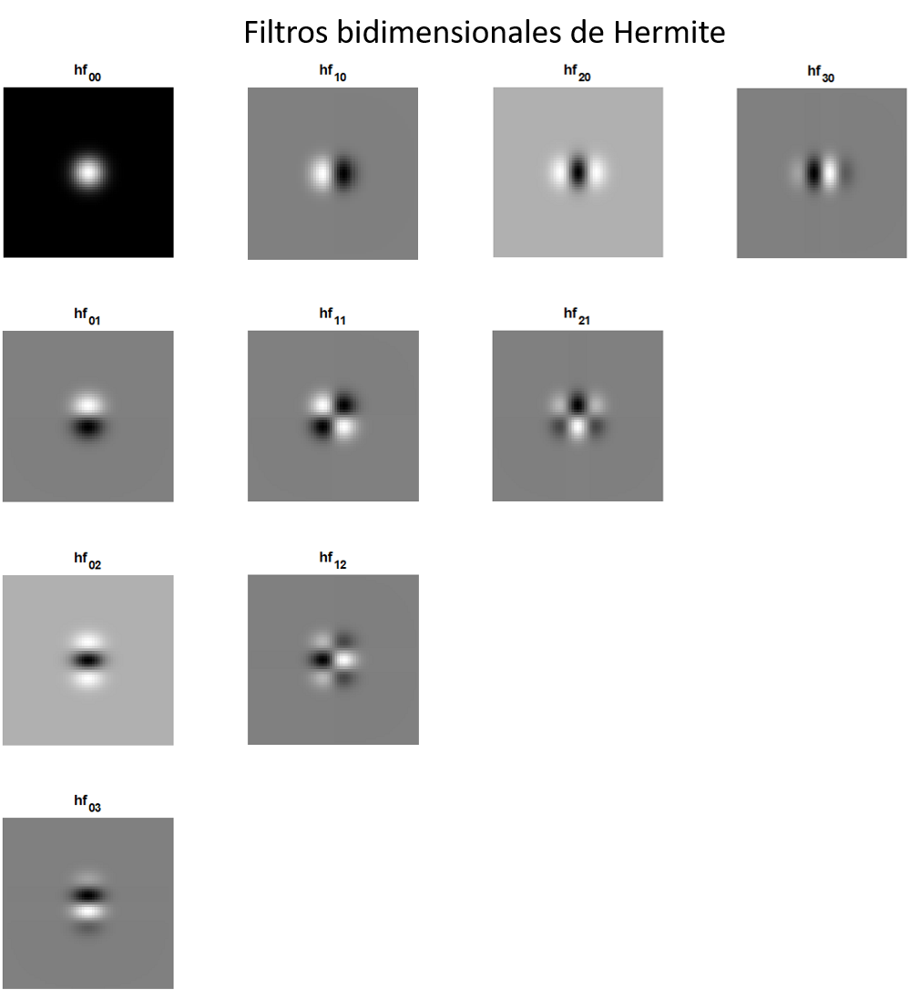

# Hermite
La transformada Hermite como herramienta para el procesamiento digital de señales.
## Polinomios ortogonales clásicos
La ecuación diferencial general lineal de segundo orden en el intervalo definido entre $-\infty$ a $\infty$, $Int = (-\infty, \infty)$, es:
\begin{equation}
p(x)u''(x) + q(x)u'(x)+r(x)u(x) = f(x), \nonumber
\end{equation}
con su correspondiente ecuación homogénea:
\begin{equation}
p(x)u''(x) + q(x)u'(x)+r(x)u(x) = 0 \nonumber
\end{equation}
y con el operador diferencial asociado:
\begin{equation}
D = p(x)\frac{d^2}{dx^2} + q(x)\frac{d}{dx} + r(x).  \qquad \qquad (1) \nonumber
\label{eq_OpDif}
\end{equation}

Las familias de polinomios ortogonales clásicos se pueden obtener a través de funciones generadoras del operador diferencial $D$, visto en la ecuación **1**. Este operador diferencial $D$ debe cumplir con la condición de simetría con respecto al peso $w$, es decir, si:
\begin{equation}
(Du,v) = (u,Dv), \nonumber
\end{equation}

donde $u$ y $v$ son un par de funciones que se anulan fuera del intervalo cerrado y acotado por definición entre los valores $a$ y $b$, $Int = [a, b]$, con el producto interno definido como:

\begin{equation}
(u,v) = (u,v)_w = \int_a^b u(x)v(w)w(x)dx \nonumber
\end{equation} 

y con el peso $w>0$. Además, el operador diferencial $D$ simétrico con respecto al peso $w$ debe tener la siguiente forma:
\begin{equation}
D = p\frac{d^2}{dx^2} + \frac{(pw)'}{w}\frac{d}{dx} + r. \qquad \qquad (2) \nonumber
\label{Simetria_D}
\end{equation}

A partir de estas definiciones y condiciones se precisa la extensión de la condición de simetría a una clase más larga de funciones y para lograrlo es necesario aplicar condiciones de frontera.

Suponiendo que las funciones $w$, $w'$, $p$, $p'$, $q$ y $r$ se extienden como funciones continuas en el intervalo cerrado $Int = [a, b]$. Además, $u$, $u'$, $v$ y $v'$ también son continuas en el mismo intervalo. Ahora, si el operador $D$ es simétrico, entonces:

\begin{equation}
(Du,v)-(u,Dv) = (pwu'v - pwuv') \Big|_a^b. \nonumber
\end{equation}

Si $pw$ se anula en ambos puntos de la frontera entonces no necesitamos condiciones adicionales en esa frontera, si no es así, se añaden condiciones sobre las funciones $u$ y $v$. De manera similar, si el intervalo es no acotado y semi infinito, $Int = [a, \infty)$, se deben imponer condiciones en $x = a$, a menos que $pw = 0$ en $x = a$. Una función $u$ que no sea idénticamente cero es una función generadora para el operador $D$ con valor generador $-\lambda$ si:

\begin{equation}
Du + \lambda u = 0.  \qquad \qquad (3) \nonumber
\label{OPDyLam}
\end{equation}

Si $u_1$ y $u_2$ son funciones generadoras con diferentes valores generadores $-\lambda_1$ y $-\lambda_2$ entonces:

\begin{equation}
-\lambda_1(u_1, u_2) = (Du_1, u_2) = (u_1, Du_2) = -\lambda_2(u_1, u_2), \nonumber
\end{equation}

además, $u_1$ y $u_2$ son ortogonales si $(u_1, u_2)  = 0$.

Ahora, se supondrá la existencia de polinomios de grados 0, 1 y 2 que son funciones generadoras de $D$, es decir, se asume que el espacio de los polinomios de grado $\leq$ $k$, $k \in \left\lbrace 0,1,2\right\rbrace $, está en el dominio de $D$. 

En primer lugar, se hará la suposición de que el peso $w$ tiene integral finita:
\begin{equation}
\int_a^b w(x)dx < \infty. \nonumber
\end{equation}

Aplicando el operador $D$, cuya condición de simetría con respecto al peso se mostró en la ecuación **2**, a la función constante $u_0(x)=1$ obtenemos $Du_0 = r$, así que $r$ debe ser una constante y podemos considerar que $r = 0$. De esta forma, aplicando $D$ a $u_1(x) = x$ obtenemos:

\begin{equation}
Du_1 = \frac{(pw)'}{w} = p' + p \frac{w'}{w}, \nonumber
\label{eq_Du1}
\end{equation}

esta expresión debe ser un polinomio de grado máximo 1. Ahora, si se considera $u_2(x) = \frac{1}{2}x^2$:

\begin{equation}
Du_2 = p + x \left( p' + p \frac{w'}{w} \right),  \nonumber
\end{equation}

por lo que $Du_2$ debe ser un polinomio de grado máximo 2, entonces, el polinomio $p$ es de grado máximo 2.

La condición de simetría requiere que:
\begin{equation}
(Du,v)-(u,Dv) = \int_a^b [pw(u'v - uv')]' = 0, \nonumber
\end{equation}

para toda $u,v$ definida en el intervalo. Como se ha mencionado anteriormente, una condición necesaria para la simetría es que $pw \to 0$ en cada punto final del intervalo. Resumiendo, se buscan soluciones polinomiales $p_n(x)$ que sean funciones generadoras de un operador diferencial de la forma:

\begin{equation}
D = p\frac{d^2}{dx^2} + q\frac{d}{dx} = \frac{1}{w} \left( pw \frac{d}{dx}\right)',  \qquad \qquad (4) \nonumber
\label{SL_eq} 
\end{equation}  

donde $orden(p) \leq 2$, $orden(q) \leq 1$, $Dp_n = \lambda_n p_n$ y 

\begin{equation}
(pw)' = qw.  \qquad \qquad (5) \nonumber
\label{eq_pearson}
\end{equation} 

A este tipo de operadores diferenciales se les denomina de tipo hipergeométrico o de tipo Sturm-Liouville. A la ecuación **5** se le denomina como la ecuación de Pearson.

Dado que $p$ es un polinomio de grado máximo 2, después de normalizaciones (mapeos afines de la recta, multiplicación del peso, el operador y los polinomios por constantes) se obtiene que existen 5 tipos de familias de polinomios ortogonales que son funciones generadoras del operador diferencial hipergeométrico $D$ (ecuación **4**) dependiendo del grado y las raíces de $p$:

1. $p$ constante: polinomios de **Hermite**.
2. $p$ lineal: polinomios de **Laguerre**. 
3. $p$ cuadátrico con raíces reales distintas: polinomios de **Jacobi**. 
4. $p$ cuadátrico con raíces complejas distintas: polinomios de **Romanovski**.
5. $p$ cuadrático con raíz doble: varias familias de polinomios.

Muchos problemas de matemáticas aplicadas y teóricas así como problemas de física conducen a ecuaciones de la forma:

\begin{equation}
\sigma(x) u'' + \tau(x)u' + \lambda u = 0,  \qquad \qquad (6) \nonumber
\label{eq1_DH}
\end{equation}

donde $\lambda$ es una constante y $\sigma(x)$ y $\tau(x)$ son polinomios de, al menos, segundo y primer grado, respectivamente. A esta ecuación se le conoce como ecuación diferencial del tipo hipergeométrico y se obtiene a través de las ecuaciones **2** y **3** e igualando:

\begin{equation*}
\sigma = p,
\end{equation*}
\begin{equation*}
\tau = q = \frac{(pw)'}{w}
\end{equation*}

y

\begin{equation*}
\lambda = r.
\end{equation*}

Un aspecto que hay que tener en cuenta es que $\lambda$ no sólo es una constante sino que además es el valor generador del operador $D$. Por otro lado, la relación que existe entre $\sigma(x)$ y $\tau(x)$ en la ecuación **6** está dada por la ecuación de Pearson que indica que $\tau(x)$ es derivada de $\sigma(x)$, siempre y cuando ambas estén multiplicadas por el peso $w$.

En conclusión tenemos que, salvo normalizaciones, las únicas familias de polinomios ortogonales que son funciones generadoras de un operador diferencial de segundo orden que obedece a la ecuación **2**, es decir, un operador diferencial simétrico con respecto a un peso $w$ positivo soportado dentro de la recta real, son las familias de Hermite, Laguerre y Jacobi. A estas familias se les suele denominar polinomios ortogonales clásicos. En la siguiente Tabla se muestra un resumen de las características de las familias clásicas.

| Funciones     | Hermite $H_n(x)$   | Laguerre $L^{\alpha}_n(x)$| Jacobi $J^{\alpha, \beta}_n(x)$        |
| :------------:|:------------------:|:-------------------------:| :-------------------------------------:|
| $Int = [a,b]$ | $(-\infty, \infty)$| $[0, \infty)$             | $[-1, 1]$                              |
| $w(x)$        | $e^{-x^2}$         | $x^{\alpha} e^{-x}$       | $(1-x)^{\alpha} (1+x)^{\beta}$         |
| $\sigma(x)$   | 1                  | $x$                       | $1-x^2$                                |
| $\tau(x)$     | $-2x$              | $1+\alpha-x$              | $ -(\alpha+\beta+2)x + \beta - \alpha$ |
| $\lambda_n$   | $2n$               | $n$                       | $-n(n+\alpha+\beta+1)$                 |

## Polinomios de Hermite

El polinomio $w' / w$ debe ser de grado máximo 1. Resolviendo la ecuación diferencial, se tiene que $w(x) = e^h$, donde $h$ es un polinomio de grado máximo 2. Las condiciones de frontera sólo se cumplen para $w(x) = e^{-x^2}$, cuyo intervalo abierto es $Int = (-\infty, \infty)$. Entonces, el polinomio $q = w'/w = -2x$ es un polinomio de grado 1, por lo tanto, el operador $D$ en este caso es:

\begin{equation}
D = \frac{d^2}{dx^2} - 2x \frac{d}{dx}. \nonumber
\end{equation}

Por cada polinomio de grado $n$, el operador $D$ lo lleva a otro polinomio del mismo grado. El valor generador para este caso es $\lambda_n = -2n$. Los polinomios ortogonales con respecto al peso $e^{-x^2}$ son los polinomios de Hermite $H_n(x)$ y cumplen con $DH_n = -2nH_n$. Una vez que el peso $w(x)$ es normalizado, éste corresponde a la distribución normal o Gaussiana.

## Transformada de Hermite

La transformada de Hermite (**TH**) es uan herramienta matemática que permite hacer una descomposición ortogonal de funciones. Fue desarrollada en los años 90 y desde entonces ha sido utilizada en muchas aplicaciones de análisis de imágenes. En esta herramienta, se usan los **polinomios de Hermite** como las funciones base de la descomposición.

Sea $H_n(x / \sigma)$ el polinomio de Hermite de grado $n$ y $G_n (x) = \frac{1}{\sqrt{2^n n!}} H_n(x / \sigma)$ el polinomio normalizado, con $n = 0,1, \ldots , \infty$. Estos polinomios son ortogonales con respecto a una función gaussiana $V^2$, es decir:

\begin{equation}
\int_{-\infty}^{\infty} V^2 G_n(x) G_m(x) dx = \delta_{nm}, \nonumber
\end{equation}

para $n=m$ y donde $V(x) = \frac{1}{\sqrt{\sigma \sqrt{\pi}}} e^{-x^2/2 \sigma^2 }$ y $\sigma$ es la desviación estándar de la función gaussiana. Dada una función $f(x)$, definida en un espacio continuo, su **TH** de orden $n$ se define como:

\begin{equation}
L_n(p) = \int_{-\infty}^{\infty} f(x)V^2(x-p)G_n(x-p)dx, \nonumber
\end{equation}

donde $L_n(p)$ corresponden a los coeficientes cartesianos de la transformación. Dado que la función $V(x)$ define una ventana, la descomposición se debe hacer para las distintas posiciones $p$ donde se requiere analizar la función.

La implementación de la transformada se puede llevar a cabo a través de un proceso de convolución entre los filtros de Hermite y la función de entrada, y luego una operación de submuestreo en las posiciones de $p$.

Los filtros de Hermite unidimensionales de orden $n$ son definidos como:

\begin{equation}
hf_n(x) = G_n(-x) V^2(-x). \qquad \qquad (7) \nonumber
\end{equation}

Sustituyendo las definiciones dadas anteriormente de Gn(x) y V(x) en la ecuación **7**: 

\begin{equation}
hf_n(x) = \frac{1}{\sqrt{2^n n!}} \left[  \frac{d^n}{d(x/\sigma)^n} \left( \frac{1}{\sigma \sqrt{\pi}} e^{-(x/ \sigma)^2} \right) \right]  \nonumber
\end{equation}

En la siguiente imagen se presenta la comparación entre los polinomios y polinomios normalizados de Hermite, la diferencia principal radica en la multiplicación de los mismos por la función gaussiana.

Polinomios de Hermite        |  Polinomios Normalizados de Hermite
:---------------------------:|:-----------------------------------:
  |  

La transformada de Hermite bidimensional **TH2D** se define de forma similar. Sea $f(x,y)$ la función de entrada, entonces su TH2D se define como: 

\begin{equation}
L_{m, n-m}(p,q) = \int \int_{-\infty}^{\infty} f(x,y)V^2(x-p, y-q)G_{m, n-m}(x-p, y-q)dxdy, \nonumber
\end{equation}

donde  $V(x,y) = \frac{1}{\sqrt{\sigma \sqrt{\pi}}} e^{-(x^2+y^2)/2 \sigma^2 }$ es la ventana gaussiana con la cual se define la condición de ortogonalidad, $G_{m, n-m} (x,y) = \frac{1}{\sqrt{2^n (n-m)! m!}} H_m(x / \sigma) H_{n-m}(y / \sigma)$ son los polinomios de Hermite normalizados y $L_{m, n-m}(p,q)$ son los coeficientes de la transformada. Los índices de los polinomios varían como $n = 0,1, \ldots, \infty$ y $m = 0, \ldots, n$, donde $n$ es el orden de la transformada. Análogamente, se pueden definir los filtros de Hermite bidimensionales como:

\begin{equation}
hf_{m, n-m}(x,y) = V^2(-x,-y) G_{m, n-m}(-x,-y) . \qquad \qquad (8) \nonumber
\end{equation}

Sustituyendo y usando las propiedades de los polinomios de Hermite, se obtienen los filtros de Hermite bidimensionales: 

\begin{equation}
hf_{m, n-m}(x,y) = \frac{1}{\sqrt{2^n (n-m)! m!}} \left( \frac{d^m}{d(x/\sigma)^m} \frac{d^{n-m}}{d(y/\sigma)^{n-m} }V^2(x,y).  \right) \qquad \qquad (9) \nonumber
\end{equation}

Los coeficientes $L_{m, n-m}(p,q)$ de la transformada se pueden obtener convolucionando el conjunto de filtros hf_{m, n-m}(x,y) con la función de entrada $f(x,y)$ y luego submuestreando en las posiciones $(p,q)$. Los filtros bidimensionales de Hermite hasta el orden $n=3$ se muestran en la siguiente figura:

## Transformada de Hermite Rotada

Una de las virtudes más reconocidas de la transformada de Hermite es su capacidad para hacer análisis direccional. Dado que en las imágenes y volúmenes es común encontrar patrones unidimensionales orientados, las transformadas direccionales llegan a ser de mucha utilidad. Los bordes y la textura son dos de las características más importantes que se pueden analizar usando procesamiento direccional. La TH cumple eficientemente con esta propiedad de rotación. Un filtro en una dirección determinada puede ser obtenido a través de una combinación lineal de unos filtros base, los cuales han sido definidos previamente en alguna dirección original. Este mismo concepto se puede extender a datos que han sido filtrados previamente con esos filtros base. Los coeficientes cartesianos de la TH en cada orden, para $n \geq 1$, son un conjunto base con el cual se pueden obtener coeficientes rotados a cierto ángulo determinado. Para llevar a cabo la rotación, se parte de la definición de los filtros de Hermite en el dominio de Fourier.

Para el proceso de rotación bidimensional, se obtiene la transformada de Fourier de los filtros definidos en la ecuación **9**:

\begin{equation}
Hf_{m, n-m}(\omega_x , \omega_y) = \frac{1}{\sqrt{2^n (n-m)! m!}} \left[ (j \omega_x \sigma)^m (j \omega_x \sigma)^{n-m} F(\omega_x, \omega_y) \right],  \nonumber
\end{equation}

donde $F(\omega_x, \omega_y)$ es la transformada de Fourier de $V^2(x,y)$. La rotación definida en coordenadas cartesianas para el caso bidimensional se define como:

\begin{equation*} % Entorno desde el cual pueden usarse los entornos y funciones matematicas
\begin{bmatrix} % El entorno bmatrix puede generar vectores tambien, en ese caso uno de 1 x 3
x_r \\
y_r
\end{bmatrix}
=
\begin{bmatrix} 
cos \theta & sen \theta \\
-sen \theta & cos \theta 
\end{bmatrix}
\begin{bmatrix}
x \\
y
\end{bmatrix}
\end{equation*}

